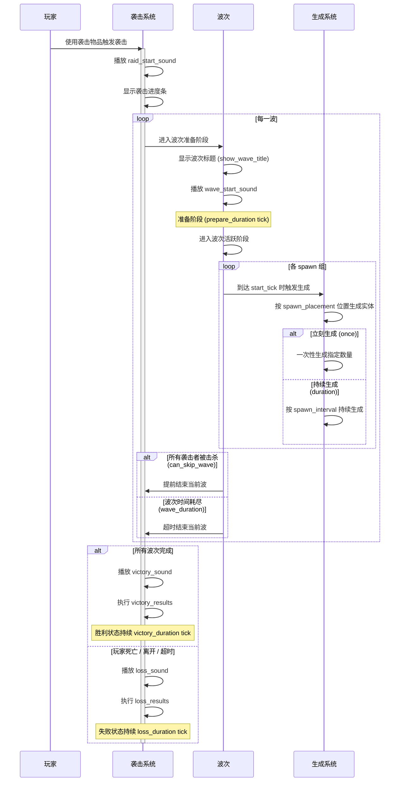

# 一般袭击

一般袭击（`htlib:common`）是和原版袭击类似的袭击类型，由多个固定的波次组成。当所有波次被击败或超时后，袭击结束并根据结果执行对应的奖励或惩罚。

## 袭击时序

一次完整的袭击按以下时序进行：



### 各阶段详解

| 阶段 | 持续时间 | 说明 |
|------|----------|------|
| **袭击触发** | 瞬间 | 玩家使用 [袭击物品](/docs/getting-started/raid-item) 触发袭击，系统初始化，播放 `raid_start_sound`，显示进度条 |
| **波次准备** | `prepare_duration` tick（默认 100） | 显示波次标题（如果 `show_wave_title` 为 `true`），播放 `wave_start_sound`，给玩家准备时间 |
| **波次活跃** | `wave_duration` tick（`0` = 无限） | 各 spawn 组按各自的 `start_tick` 依次激活，生成袭击者。玩家需要在此期间击败所有袭击者 |
| **波次跳过** | 瞬间 | 当 `can_skip_wave` 为 `true` 且所有袭击者被击杀时，立即跳到下一波的准备阶段 |
| **胜利结算** | `victory_duration` tick（默认 100） | 所有波次完成后触发，播放 `victory_sound`，按顺序执行 `victory_results` |
| **失败结算** | `loss_duration` tick（默认 100） | 袭击失败时触发，播放 `loss_sound`，按顺序执行 `loss_results` |

> **提示**：如果 `wave_duration` 设为 `0`，则该波没有时间限制，玩家必须击败所有袭击者才能进入下一波（前提是 `can_skip_wave` 为 `true`）。

## 字段说明

| 字段 | 类型 | 描述 |
|------|------|------|
| `type` | 字符串 | 袭击类型，固定为 `htlib:common` |
| `setting` | [袭击设置](#袭击设置) | 袭击相关的全局设置 |
| `waves` | 字符串列表 | 袭击包含的波次，按顺序引用 [波组件](/docs/advanced-guides/wave) 的注册名 |

### 完整示例

下面是一个包含三个波次的一般袭击 JSON 配置：

```json
{
  "type": "htlib:common",
  "setting": {
    "bar_setting": {
      "raid_bar_color": "red"
    },
    "border_setting": {
      "block_inside": true,
      "block_outside": true,
      "raid_range": 40.0,
      "render_border": true
    },
    "sound_setting": {
      "raid_start_sound": "htlib:prepare",
      "wave_start_sound": "htlib:huge_wave",
      "victory_sound": "htlib:victory",
      "loss_sound": "htlib:loss"
    },
    "victory_results": [
      "htlib:common_function",
      "htlib:command_function"
    ],
    "loss_results": [
      "htlib:clear_raiders"
    ]
  },
  "waves": [
    "htlib:common_wave_1",
    "htlib:common_wave_2",
    "htlib:common_wave_3"
  ]
}
```

## 袭击设置

| 字段 | 类型 | 默认值 | 描述 |
|------|------|--------|------|
| `bar_setting` | 袭击条设置 | — | 袭击进度条相关设置 |
| `border_setting` | 边界设置 | — | 袭击边界相关设置 |
| `sound_setting` | 音效设置 | — | 袭击音效相关设置 |
| `victory_results` | 字符串列表 | `[]` | 袭击胜利时执行的 [结果组件](/docs/advanced-guides/result) |
| `loss_results` | 字符串列表 | `[]` | 袭击失败时执行的 [结果组件](/docs/advanced-guides/result) |
| `victory_duration` | 整数 | `100` | 袭击胜利状态的持续时间（tick） |
| `loss_duration` | 整数 | `100` | 袭击失败状态的持续时间（tick） |
| `show_wave_title` | 布尔值 | `true` | 是否在每波开始时显示标题 |

### 边界设置

| 字段 | 类型 | 默认值 | 描述 |
|------|------|--------|------|
| `raid_range` | 浮点数 | `40.0` | 袭击边界的半径 |
| `block_inside` | 布尔值 | `false` | 是否阻挡进入边界 |
| `block_outside` | 布尔值 | `false` | 是否阻挡离开边界 |
| `render_border` | 布尔值 | `false` | 是否渲染边界粒子 |
| `border_color` | 整数 | 原版默认 | 边界颜色（ARGB 格式） |

### 音效设置

| 字段 | 类型 | 默认值 | 描述 |
|------|------|--------|------|
| `raid_start_sound` | 字符串 | 空 | 袭击开始时播放的音效 ID |
| `wave_start_sound` | 字符串 | 空 | 每波开始时播放的音效 ID |
| `victory_sound` | 字符串 | 空 | 袭击胜利时播放的音效 ID |
| `loss_sound` | 字符串 | 空 | 袭击失败时播放的音效 ID |

### 袭击条设置

| 字段 | 类型 | 默认值 | 描述 |
|------|------|--------|------|
| `raid_title` | 字符串 | 自动生成 | 袭击进度条显示的标题 |
| `raid_bar_color` | 字符串 | `red` | 进度条颜色，可选：`red`、`blue`、`green`、`yellow`、`purple`、`white` |
| `victory_title` | 字符串 | 自动生成 | 袭击胜利时显示的标题 |
| `loss_title` | 字符串 | 自动生成 | 袭击失败时显示的标题 |
