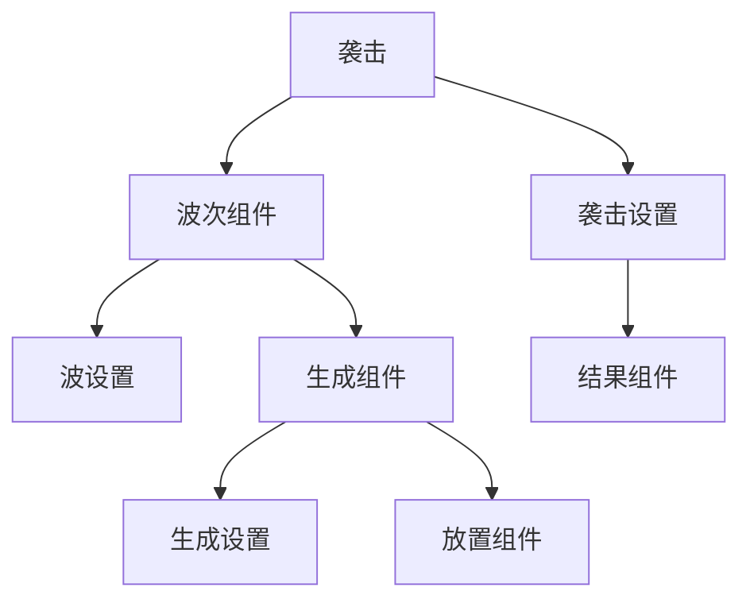

import DocCardList from '@theme/DocCardList';

# 袭击组件

本模组对原版的袭击进行了一定的抽象，使其能够通过**数据包**更灵活地自定义。你可以自由定义袭击的波次、每波生成的怪物、怪物的生成方式、袭击的结果等。

## 数据包结构

所有袭击相关的组件存放在数据包的 `data/<mod_id>/htlib/raid` 路径下：

```plain
.
├── data
│   └── mod_id
│       └── htlib
│           ├── raid              ← 袭击定义
│           ├── wave              ← 波次定义
│           ├── spawn             ← 怪物生成
│           ├── position          ← 生成位置
│           ├── result            ← 结果/奖励
│           └── raid_item         ← 袭击召唤物品
```

## 组件关系

一个完整的袭击由以下组件层层组合而成：



简单来说：**一次袭击包含多个波，每波包含多组怪物生成，每组生成可以指定放置位置；袭击结束时会触发结果（奖励/惩罚）。**

## 类型汇总

| 类型 | 描述 |
|------|------|
| `htlib:common` | 一般袭击，和原版袭击类似，由多个固定的波次组成 |

## 快速开始

如果你还没有准备好数据包模板，请先参考 [数据包准备](/docs/getting-started/data-pack)。

## 章节导航

<DocCardList />
