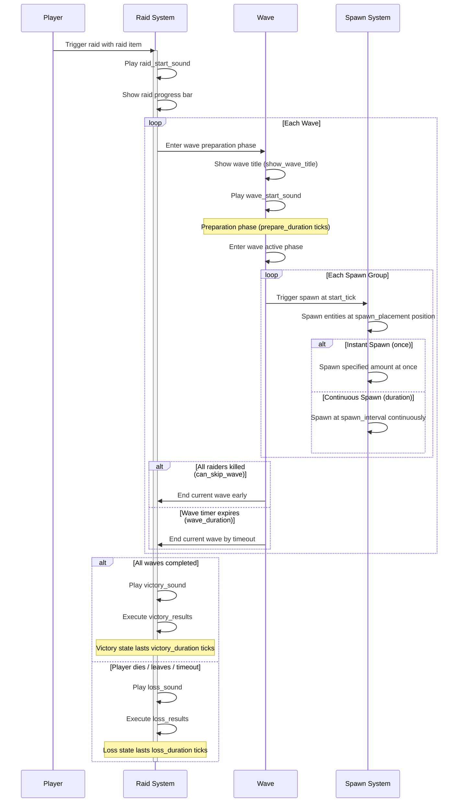

# Common Raid

A common raid (`htlib:common`) is similar to vanilla raids, composed of multiple fixed waves. When all waves are defeated or time out, the raid ends and triggers the corresponding rewards or penalties.

## Raid Timeline

A complete raid follows this timeline:



### Phase Details

| Phase | Duration | Description |
|------|----------|------|
| **Raid Trigger** | Instant | Player uses a [raid item](/docs/getting-started/raid-item) to trigger the raid. System initializes, plays `raid_start_sound`, and shows the progress bar |
| **Wave Preparation** | `prepare_duration` ticks (default 100) | Shows wave title (if `show_wave_title` is `true`), plays `wave_start_sound`, giving players time to prepare |
| **Wave Active** | `wave_duration` ticks (`0` = unlimited) | Each spawn group activates at its `start_tick`, spawning raiders. Players must defeat all raiders during this phase |
| **Wave Skip** | Instant | When `can_skip_wave` is `true` and all raiders are killed, immediately jumps to the next wave's preparation phase |
| **Victory** | `victory_duration` ticks (default 100) | Triggered when all waves are completed. Plays `victory_sound`, executes `victory_results` in order |
| **Loss** | `loss_duration` ticks (default 100) | Triggered when the raid fails. Plays `loss_sound`, executes `loss_results` in order |

> **Tip**: If `wave_duration` is set to `0`, the wave has no time limit and players must defeat all raiders to proceed to the next wave (provided `can_skip_wave` is `true`).

## Fields

| Field | Type | Description |
|------|------|------|
| `type` | String | Raid type, fixed as `htlib:common` |
| `setting` | [Raid Settings](#raid-settings) | Global settings for the raid |
| `waves` | String List | Waves included in the raid, referencing [wave components](/docs/advanced-guides/wave) by registered name in order |

### Full Example

Below is a JSON configuration for a common raid with three waves:

```json
{
  "type": "htlib:common",
  "setting": {
    "bar_setting": {
      "raid_bar_color": "red"
    },
    "border_setting": {
      "block_inside": true,
      "block_outside": true,
      "raid_range": 40.0,
      "render_border": true
    },
    "sound_setting": {
      "raid_start_sound": "htlib:prepare",
      "wave_start_sound": "htlib:huge_wave",
      "victory_sound": "htlib:victory",
      "loss_sound": "htlib:loss"
    },
    "victory_results": [
      "htlib:common_function",
      "htlib:command_function"
    ],
    "loss_results": [
      "htlib:clear_raiders"
    ]
  },
  "waves": [
    "htlib:common_wave_1",
    "htlib:common_wave_2",
    "htlib:common_wave_3"
  ]
}
```

## Raid Settings

| Field | Type | Default | Description |
|------|------|--------|------|
| `bar_setting` | Bar Settings | — | Raid progress bar settings |
| `border_setting` | Border Settings | — | Raid border settings |
| `sound_setting` | Sound Settings | — | Raid sound settings |
| `victory_results` | String List | `[]` | [Result components](/docs/advanced-guides/result) executed on victory |
| `loss_results` | String List | `[]` | [Result components](/docs/advanced-guides/result) executed on loss |
| `victory_duration` | Integer | `100` | Duration of the victory state (ticks) |
| `loss_duration` | Integer | `100` | Duration of the loss state (ticks) |
| `show_wave_title` | Boolean | `true` | Whether to show the wave title at the start of each wave |

### Border Settings

| Field | Type | Default | Description |
|------|------|--------|------|
| `raid_range` | Float | `40.0` | Radius of the raid border |
| `block_inside` | Boolean | `false` | Whether to block entities from entering the border |
| `block_outside` | Boolean | `false` | Whether to block entities from leaving the border |
| `render_border` | Boolean | `false` | Whether to render border particles |
| `border_color` | Integer | Vanilla default | Border color (ARGB format) |

### Sound Settings

| Field | Type | Default | Description |
|------|------|--------|------|
| `raid_start_sound` | String | Empty | Sound ID played when the raid starts |
| `wave_start_sound` | String | Empty | Sound ID played at the start of each wave |
| `victory_sound` | String | Empty | Sound ID played on raid victory |
| `loss_sound` | String | Empty | Sound ID played on raid loss |

### Bar Settings

| Field | Type | Default | Description |
|------|------|--------|------|
| `raid_title` | String | Auto-generated | Title displayed on the raid progress bar |
| `raid_bar_color` | String | `red` | Progress bar color. Options: `red`, `blue`, `green`, `yellow`, `purple`, `white` |
| `victory_title` | String | Auto-generated | Title displayed on raid victory |
| `loss_title` | String | Auto-generated | Title displayed on raid loss |
