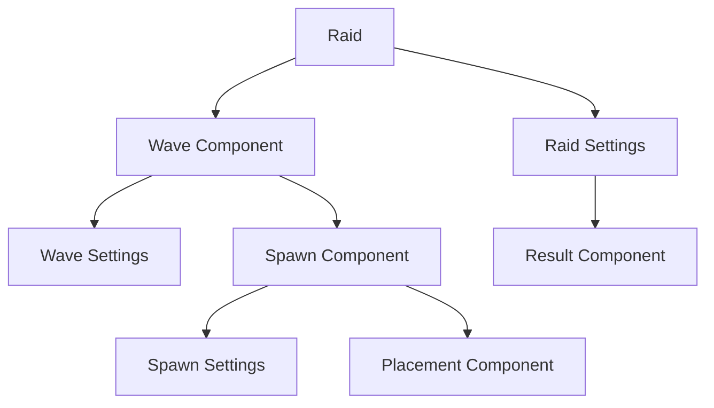

import DocCardList from '@theme/DocCardList';

# Raid Component

This mod abstracts vanilla raids to make them more flexibly customizable via **data packs**. You can freely define raid waves, mobs spawned per wave, spawning methods, raid results, and more.

## Data Pack Structure

All raid-related components are stored under `data/<mod_id>/htlib/raid/` in your data pack:

```plain
.
├── data
│   └── mod_id
│       └── htlib
│           ├── raid              ← Raid definitions
│           ├── wave              ← Wave definitions
│           ├── spawn             ← Mob spawning
│           ├── position          ← Spawn positions
│           ├── result            ← Results/rewards
│           └── raid_item         ← Raid summoning items
```

## Component Relationships

A complete raid is composed of the following layered components:



In short: **A raid contains multiple waves, each wave contains multiple mob spawn groups, each spawn group can specify a placement position; results (rewards/penalties) are triggered when the raid ends.**

## Type Summary

| Type | Description |
|------|------|
| `htlib:common` | Common raid, similar to vanilla raids, composed of multiple fixed waves |

## Quick Start

If you haven't prepared a data pack template yet, please refer to [Data Pack Preparation](/docs/getting-started/data-pack).

## Chapter Navigation

<DocCardList />
